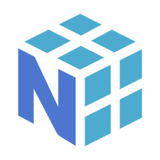

# About me 👨‍💻
I am Mohammad, and I work in the field of artificial intelligence and data science. I have been involved in coding for about 3 years now, and in the past year, I have dedicated all my time to learning artificial intelligence. I hope to become one of the best in this field.

<h3>

Project Highlights 🚀
 
<h6>
  
- **Iris Dataset**:
  Conducted comprehensive analysis using the Iris dataset to categorize flowers based on features such as "SepalLengthCm" and "PetalWidthCm."

- **Titanic Dataset:**
  Built a predictive model to determine passenger survival on the Titanic using machine learning techniques, analyzing factors like gender, class, and age.

- **Adult Dataset:**
  Utilized the Adult dataset to predict financial status based on socio-economic factors, employing data analysis and predictive modeling.

- **NYC Taxi Trip Duration:**
  Investigated NYC Taxi Trip Duration dataset, extracting insights and developing models to predict taxi trip durations, enhancing transportation efficiency.
</h6>

Skill Set 💪

<h5>
  
Programming Languages
|Python|
|-|
|  |

Libraries and Frameworks
|scikit-learn|docker|pytorch|seaborn|numpy|pandas|
|-|-|-|-|-|-|
|  |  |  |  |  |  |

Databases
|SQL|Mongodb|
|-|-|
|  |                      |

Tools
|ubuntu|vscode|git|jupyter_lab|
|-|-|-|-|
|  |  |  |  |

</h5>

</h3>

 

 

# Let's Connect 🤝

You can reach me via email at pshafyy@gmail.com or connect with me on LinkedIn: [LinkedIn Profile](https://www.linkedin.com/in/mohammad-shafi-i-007034238).

Feel free to visit my website for more information: [MyWebsite](https://www.mo3h.ir).

